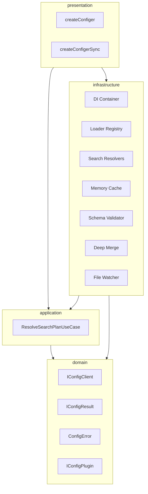
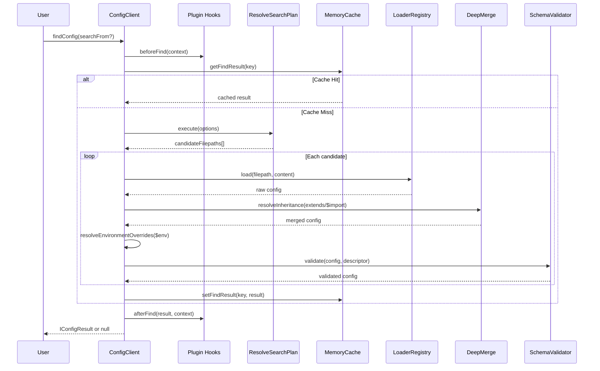

<a id="top"></a>

<p align="center">
  
</p>

<h1 align="center">⚙️ Configer</h1>
<p align="center"><em>Production-grade config loader with cosmiconfig-level capabilities and a clean original API</em></p>

<p align="center">
    <a aria-label="ElsiKora logo" href="https://elsikora.com">
  
</a>        
</p>

## 💡 Highlights

- 🎯 Deterministic config resolution with 4 search strategies (none, project, workspace, global) and 40+ default search places per module name
- 📦 First-class support for 10+ formats — JSON, YAML, TOML, JSON5, JSONC, .env, JS/TS modules, and package.json properties — with both async and sync loaders
- 🔗 Config inheritance ($import/extends), environment overlays ($env/$development), schema validation, and plugin hooks — all built-in with zero config
- 🏗️ Clean Architecture internals with full DI container, making every component testable, replaceable, and independently extensible

## 📚 Table of Contents
- [Description](#-description)
- [Tech Stack](#-tech-stack)
- [Features](#-features)
- [Architecture](#-architecture)
- [Project Structure](#-project-structure)
- [Prerequisites](#-prerequisites)
- [Installation](#-installation)
- [Usage](#-usage)
- [Roadmap](#-roadmap)
- [FAQ](#-faq)
- [License](#-license)
- [Acknowledgments](#-acknowledgments)

## 📖 Description
Configer is a **typed, extensible configuration loader** for Node.js that resolves config files across project, workspace, and global scopes — with deterministic search plans, config inheritance chains, environment overlays, schema validation, and plugin lifecycle hooks.

Built with **clean architecture** principles (domain → application → infrastructure → presentation layers) and powered by a dependency injection container, Configer delivers the flexibility of cosmiconfig with stronger type safety, explicit error codes, and a modular internal design.

### Real-World Use Cases

- **CLI Tools & Dev Tooling**: Automatically discover `.toolrc`, `.toolrc.yaml`, `tool.config.ts`, or `package.json` properties — just like ESLint, Prettier, and Babel do — but with full TypeScript generics and schema validation out of the box.
- **Monorepo Configuration**: Use the `workspace` search strategy to traverse from any nested package up to the workspace root, merging shared base configs with per-package overrides.
- **Multi-Environment Apps**: Define `$development`, `$production`, or `$env` blocks directly in config files. Configer strips inactive environments and deep-merges the active one — no extra tooling required.
- **Plugin Ecosystems**: Extend the config lifecycle with `beforeFind`, `afterRead`, and `onError` hooks to inject defaults, validate against external schemas, or log diagnostics.
- **Library Authors**: Ship a typed config contract (`IConfigOptions<TEntity>`) so consumers get autocomplete and compile-time safety for your tool's configuration.

## 🛠️ Tech Stack

| Category | Technologies |
|----------|-------------|
| **Language** | TypeScript |
| **Runtime** | Node.js >= 20.0.0 |
| **Build Tool** | Rollup, TypeScript Compiler |
| **Testing** | Vitest, V8 Coverage |
| **Linting** | ESLint, Prettier |
| **Package Manager** | npm |
| **CI/CD** | Semantic Release, Husky, Commitlint |
| **Dependencies** | yaml, smol-toml, json5, jsonc-parser, dotenv, @elsikora/cladi |

## 🚀 Features
- ✨ ****Async & Sync Clients** — `createConfiger()` for async IO with watch support; `createConfigerSync()` for synchronous-only flows with strict fail-fast guarantees**
- ✨ ****10+ Built-in Loaders** — JSON, JSON5, JSONC, YAML, TOML, .env, JS (.js/.cjs/.mjs), TypeScript (.ts/.cts/.mts), and package.json property extraction**
- ✨ ****4 Search Strategies** — `none` (current directory), `project` (up to package.json), `workspace` (up to monorepo root), `global` (including XDG config home)**
- ✨ ****Config Inheritance** — Merge parent configs via `extends` or `$import` directives with circular reference detection and source chain tracking**
- ✨ ****Environment Overlays** — `$development`, `$production`, or `$env` map blocks are deep-merged for the active environment and stripped from output**
- ✨ ****Built-in Schema Validation** — Declare required fields, types, defaults, nested objects, array items, and custom validators without external dependencies**
- ✨ ****Plugin Lifecycle Hooks** — `beforeFind`, `afterFind`, `beforeRead`, `afterRead`, and `onError` hooks for extending every stage of config resolution**
- ✨ ****Custom Loaders** — Register async/sync loaders for any file extension (`.ini`, `.xml`, `.custom`) via the `loaders` option**
- ✨ ****Watch Mode** — File system watcher with debounced refresh, automatic cache invalidation, and clean `IWatchHandle.close()` cleanup**
- ✨ ****Caching Layer** — Separate find/read caches with granular `clearFindCache()`, `clearReadCache()`, and `clearCaches()` controls**
- ✨ ****Stable Error Codes** — Every failure throws `ConfigError` with a machine-readable `CODE` and human-readable `SUGGESTIONS` array**
- ✨ ****Clean Architecture** — Domain-driven layers (domain → application → infrastructure → presentation) with full DI container for testability**

## 🏗 Architecture

### System Architecture



### Data Flow



## 📁 Project Structure

<details>
<summary>Click to expand</summary>

```
Configer/
├── docs/
│   ├── api-reference/
│   │   ├── error-codes/
│   │   ├── factories/
│   │   ├── interfaces/
│   │   ├── types/
│   │   ├── _meta.js
│   │   └── page.mdx
│   ├── core-concepts/
│   │   ├── caching-and-watch/
│   │   ├── environment-overrides/
│   │   ├── inheritance-and-merge/
│   │   ├── resolution-flow/
│   │   ├── schema-validation/
│   │   ├── _meta.js
│   │   └── page.mdx
│   ├── getting-started/
│   │   ├── first-client/
│   │   ├── first-config-read/
│   │   ├── installation/
│   │   ├── sync-mode/
│   │   ├── _meta.js
│   │   └── page.mdx
│   ├── guides/
│   │   ├── custom-loaders/
│   │   ├── custom-search-places/
│   │   ├── package-json-property/
│   │   ├── plugins/
│   │   ├── watch-mode/
│   │   ├── _meta.js
│   │   └── page.mdx
│   ├── _meta.js
│   └── page.mdx
├── examples/
│   ├── 01-basic-usage/
│   │   └── main.ts
│   ├── 02-search-strategies/
│   │   └── main.ts
│   ├── 03-file-formats/
│   │   └── main.ts
│   ├── 04-inheritance/
│   │   └── main.ts
│   ├── 05-environment-overrides/
│   │   └── main.ts
│   ├── 06-plugins/
│   │   └── main.ts
│   ├── 07-schema-validation/
│   │   └── main.ts
│   ├── 08-custom-loaders/
│   │   └── main.ts
│   ├── 09-watch-mode/
│   │   └── main.ts
│   ├── 10-package-json-property/
│   │   └── main.ts
│   ├── README.md
│   └── tsconfig.json
├── scripts/
│   ├── clean.function.js
│   └── validate-documentation.function.js
├── src/
│   ├── application/
│   │   ├── dto/
│   │   ├── interface/
│   │   ├── use-case/
│   │   └── index.ts
│   ├── domain/
│   │   ├── entity/
│   │   ├── error/
│   │   ├── type/
│   │   └── index.ts
│   ├── infrastructure/
│   │   ├── adapter/
│   │   ├── cache/
│   │   ├── di/
│   │   ├── loader/
│   │   ├── resolver/
│   │   ├── service/
│   │   ├── watcher/
│   │   └── index.ts
│   ├── presentation/
│   │   ├── function/
│   │   └── index.ts
│   └── index.ts
├── test/
│   ├── e2e/
│   │   ├── configer-error-paths.end-to-end.test.ts
│   │   └── configer-integration.end-to-end.test.ts
│   └── unit/
│       ├── application/
│       ├── domain/
│       ├── infrastructure/
│       └── presentation/
├── commitlint.config.js
├── eslint.config.js
├── generated-logo.png
├── lint-staged.config.js
├── package-lock.json
├── package.json
├── prettier.config.js
├── README.md
├── release.config.js
├── rollup.config.js
├── tsconfig.build.json
├── tsconfig.json
├── vitest.config.js
├── vitest.end-to-end.config.js
└── vitest.unit.config.js
```

</details>

## 📋 Prerequisites

- Node.js >= 20.0.0
- npm >= 9.0.0 (or pnpm / yarn equivalent)
- ESM-compatible project ("type": "module" in package.json)

## 🛠 Installation
```bash
# Using npm
npm install @elsikora/configer

# Using pnpm
pnpm add @elsikora/configer

# Using yarn
yarn add @elsikora/configer


Verify the installation:

ts
import { createConfiger } from '@elsikora/configer';

const client = createConfiger({ moduleName: 'my-app' });
console.log(typeof client.findConfig === 'function'); // true
```

## 💡 Usage
### Basic Async Usage

```ts
import { createConfiger } from '@elsikora/configer';
import type { IConfigClient, IConfigResult } from '@elsikora/configer';

type AppConfig = {
  serviceName: string;
  isFeatureEnabled: boolean;
};

const client: IConfigClient<AppConfig> = createConfiger<AppConfig>({
  moduleName: 'my-app',
  cwd: process.cwd(),
});

const result: IConfigResult<AppConfig> | null = await client.findConfig();

if (result) {
  console.log(result.filepath);              // /project/.my-apprc.json
  console.log(result.config?.serviceName);    // "billing-api"
}
```

### Sync Mode

```ts
import { createConfigerSync } from '@elsikora/configer';

const client = createConfigerSync<{ retries: number }>({
  moduleName: 'my-app',
});

const result = client.findConfig();
console.log(result?.config?.retries); // 3
```

### Search Strategies

```ts
// Search only the current directory
const client = createConfiger({ moduleName: 'app', searchStrategy: 'none' });

// Ascend until nearest package.json
const client = createConfiger({ moduleName: 'app', searchStrategy: 'project' });

// Ascend until workspace root (.git, pnpm-workspace.yaml, etc.)
const client = createConfiger({ moduleName: 'app', searchStrategy: 'workspace' });

// Traverse project + workspace + global config directory
const client = createConfiger({ moduleName: 'app', searchStrategy: 'global' });
```

### Config Inheritance

Create a base config (`base.config.json`):
```json
{ "logLevel": "info", "retries": 1 }
```

Extend it in your app config (`.my-apprc.json`):
```json
{
  "extends": "./base.config.json",
  "retries": 3
}
```

Result: `{ logLevel: "info", retries: 3 }` with `sources` tracking the full chain.

### Environment Overrides

```json
{
  "apiUrl": "https://api.default.com",
  "$development": { "apiUrl": "https://dev.api.com" },
  "$env": {
    "production": { "apiUrl": "https://prod.api.com" }
  }
}
```

```ts
const client = createConfiger({
  moduleName: 'app',
  envName: 'development', // or reads NODE_ENV automatically
});
```

### Schema Validation

```ts
import type { ISchemaDescriptor } from '@elsikora/configer';

const schema: ISchemaDescriptor<{ serviceName: string; retryCount: number }> = {
  type: 'object',
  properties: {
    serviceName: { type: 'string', isRequired: true },
    retryCount: { type: 'number', defaultValue: 3 },
  },
  shouldAllowUnknownProperties: false,
};

const client = createConfiger({
  moduleName: 'app',
  schema,
});
```

### Plugin Hooks

```ts
const client = createConfiger({
  moduleName: 'app',
  plugins: [
    {
      name: 'source-marker',
      afterRead: (result) => ({
        ...result,
        config: { ...result.config, _loadedFrom: result.filepath },
      }),
      onError: (error) => console.error('Config error:', error.message),
    },
  ],
});
```

### Custom Loaders

```ts
const client = createConfiger({
  moduleName: 'app',
  searchPlaces: ['config.ini'],
  shouldMergeSearchPlaces: false,
  loaders: {
    '.ini': {
      asyncLoader: (_filepath, content) => parseIni(content),
      syncLoader: (_filepath, content) => parseIni(content),
    },
  },
});
```

### Watch Mode

```ts
const handle = client.watchConfig((error, result) => {
  if (error) return console.error(error);
  console.log('Config changed:', result?.config);
});

// Cleanup on shutdown
process.on('SIGTERM', () => handle.close());
```

### Reading from package.json

```ts
const client = createConfiger({
  moduleName: 'my-tool',
  packageProperty: 'config.myTool', // or ['config', 'myTool']
  searchPlaces: ['package.json'],
  shouldMergeSearchPlaces: false,
});
```

## 🛣 Roadmap

<details>
<summary>Click to expand</summary>

| Task / Feature | Status |
|---|---|
| Core async/sync config client with search strategies | ✅ Done |
| Built-in loaders for JSON, YAML, TOML, JSON5, JSONC, .env, JS/TS | ✅ Done |
| Config inheritance via `extends` and `$import` with cycle detection | ✅ Done |
| Environment overrides (`$env`, `$development`, `$production`) | ✅ Done |
| Built-in schema validation with nested objects and arrays | ✅ Done |
| Plugin lifecycle hooks (beforeFind, afterRead, onError) | ✅ Done |
| Watch mode with debounced file system monitoring | ✅ Done |
| Clean Architecture with full DI container | ✅ Done |
| Comprehensive unit and e2e test suites | ✅ Done |
| MDX documentation site with guides and API reference | ✅ Done |
| Remote config source support (HTTP/S3) | 🚧 In Progress |
| Config encryption/decryption plugin | 🚧 In Progress |
| JSON Schema / Zod adapter for schema validation | 🚧 In Progress |
| Config diff and migration tooling | 🚧 In Progress |

</details>

## ❓ FAQ

<details>
<summary>Click to expand</summary>

### How is Configer different from cosmiconfig?

Configer is inspired by cosmiconfig but built from scratch with TypeScript generics, Clean Architecture internals, and additional features: config inheritance, environment overlays, schema validation, plugin hooks, and watch mode — all built-in without extra packages.

### Can I migrate from cosmiconfig?

- Replace `cosmiconfig(moduleName, options)` → `createConfiger({ moduleName, ...options })`
- Replace `search()` → `findConfig()`
- Replace `load(filepath)` → `readConfig(filepath)`
- Use `createConfigerSync` for synchronous API
- Move custom transforms into plugins (`beforeRead`, `afterRead`, `onError`)

### What file formats are supported out of the box?

JSON, JSON5, JSONC, YAML (.yaml/.yml), TOML, .env, JavaScript modules (.js/.cjs/.mjs), TypeScript modules (.ts/.cts/.mts), and `package.json` with nested property extraction.

### Can I use this in a CommonJS project?

Configer is published as ESM only. Your project needs `"type": "module"` in package.json or you can use dynamic `import()` from CJS code.

### When should I use the sync client vs async client?

Use `createConfigerSync()` only when your runtime strictly requires synchronous behavior (e.g., synchronous CLI startup). The sync client cannot load `.mjs`, `.mts`, or `.ts` files, and plugin hooks must not return Promises. For all other cases, prefer `createConfiger()` (async).

### How does the search strategy work?

- **none**: Only searches the start directory
- **project**: Ascends directories until it finds a `package.json`
- **workspace**: Ascends until a workspace root marker (`.git`, `pnpm-workspace.yaml`, `turbo.json`, etc.)
- **global**: Combines project/workspace traversal with `$XDG_CONFIG_HOME/<moduleName>` or `~/.config/<moduleName>`

### How do I handle errors?

All errors are instances of `ConfigError` with a stable `.CODE` property for programmatic handling and a `.SUGGESTIONS` array with actionable fix recommendations. Use `error.CODE` for branching logic and `error.message` for user-facing output.

</details>

## 🔒 License
This project is licensed under **MIT**.

## 🙏 Acknowledgments
- Inspired by [cosmiconfig](https://github.com/cosmiconfig/cosmiconfig) — the gold standard for config file discovery in the Node.js ecosystem
- Built with [@elsikora/cladi](https://github.com/ElsiKora/cladi) — a lightweight dependency injection container
- Parsing powered by [yaml](https://github.com/eemeli/yaml), [smol-toml](https://github.com/nicolo-ribaudo/smol-toml), [json5](https://github.com/json5/json5), [jsonc-parser](https://github.com/microsoft/node-jsonc-parser), and [dotenv](https://github.com/motdotla/dotenv)
- Testing with [Vitest](https://vitest.dev/) and [@elsikora/cladi-testing](https://github.com/ElsiKora/cladi-testing)
- Thanks to the open-source community for feedback and inspiration

---

<p align="center">
  <a href="#top">Back to Top</a>
</p>